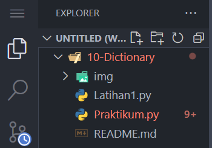
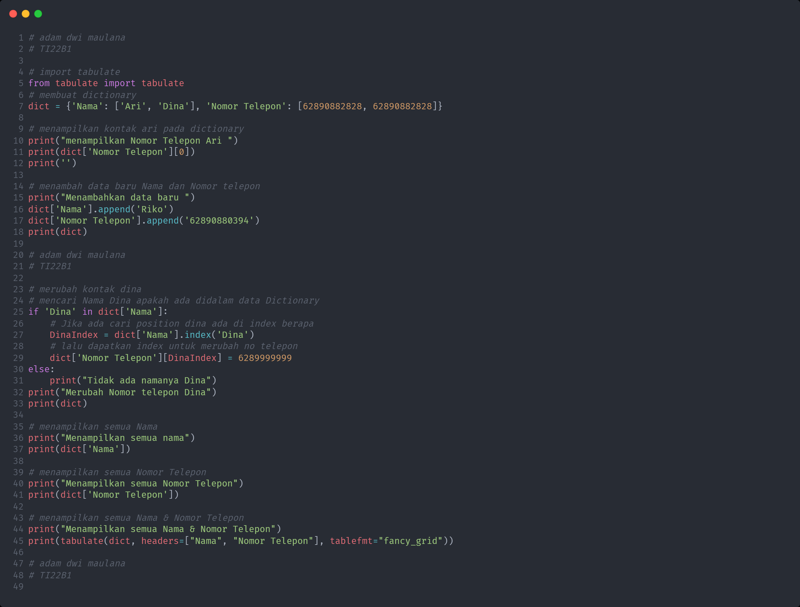
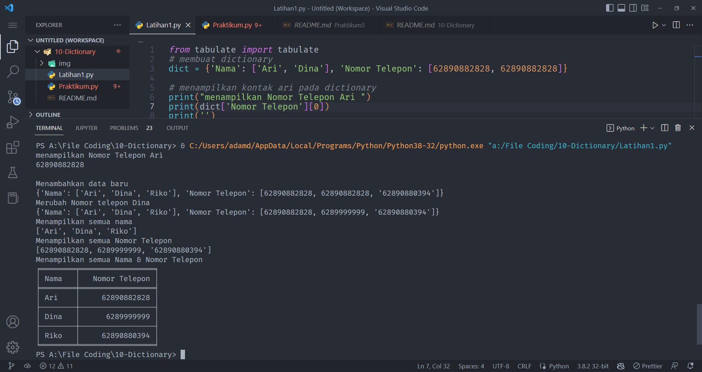
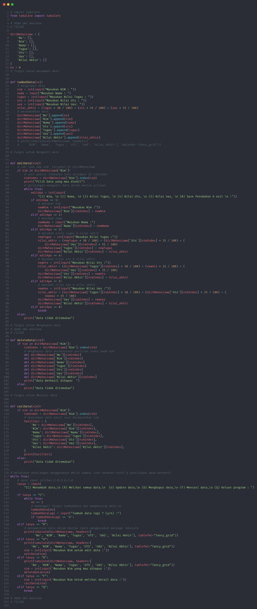
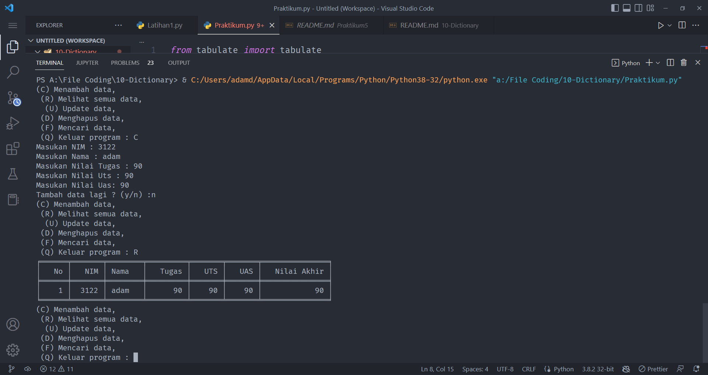
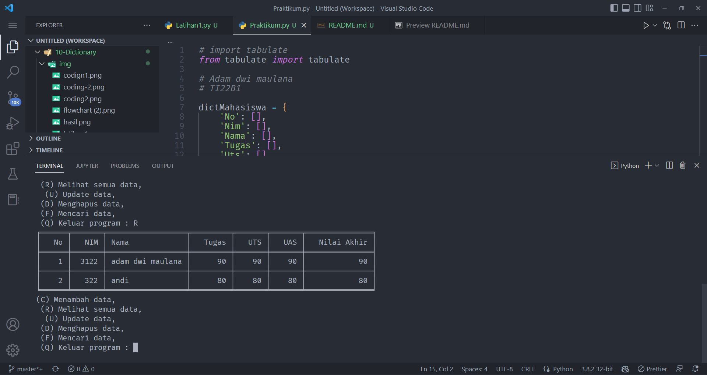
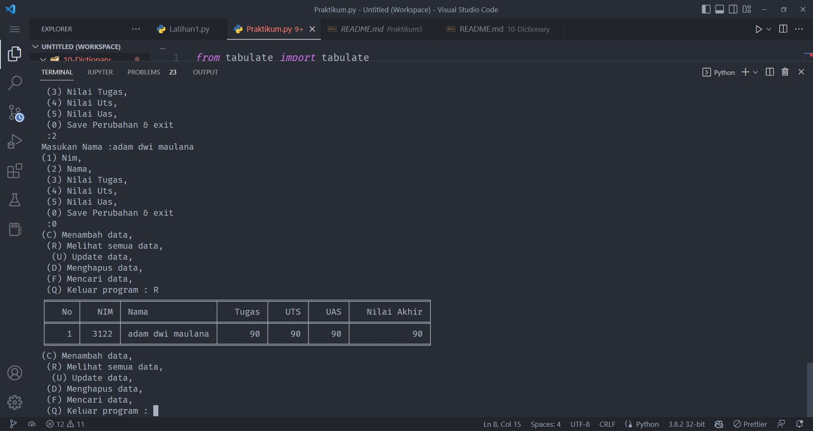
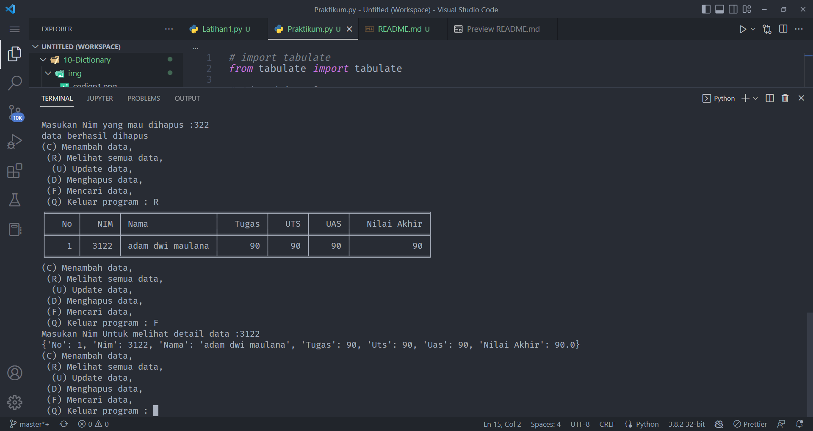
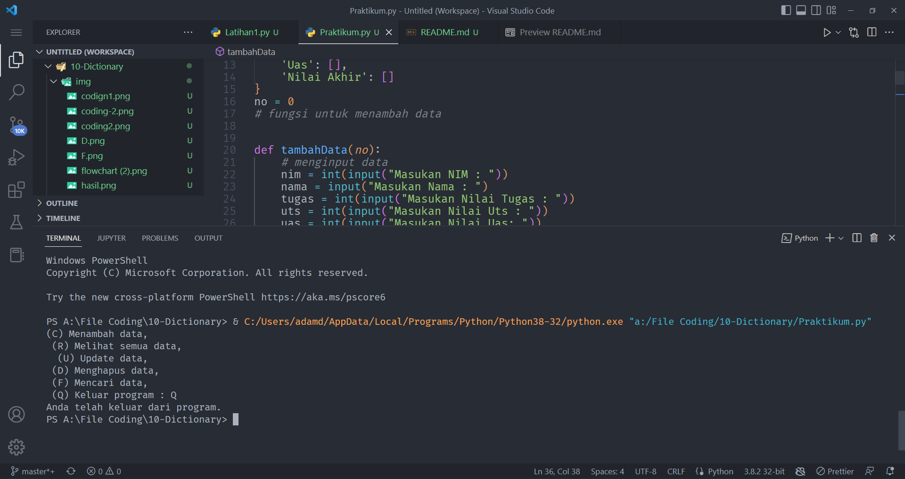

## Latihan Dictionary pada python membuat program crud sederhana
### Repository ini dibuat sebagai tugas kuliah bahasa pemrogramman

1. Pertama kita buat buat folder `10-Dictionary` dan didalam kita buat file bernama `Latihan1.py` dan `Praktikum.py`.

      

2. Lalu buka Latihan1.py dan masukan coding sebagai berikut lalu run dengan mengetikan perintah berikut diterminal `python Latihan1.py`:

      

      dan berikut hasilnya :

      

3. Selanjutnya kita akan buat program crud sederhana dan berikut `flowchart` program yang akan dibuat.

      .png)

4. Lalu buka file `Praktikum.py` dan masukan codingan sebagai berikut lalu run dengan mengetikan perintah berikut diterminal `python Praktikum.py`:

      

      dan Berikut hasilnya :

      Jika memilih opsi `C = menambah data` maka akan tampil sebagai berikut :

      

      Jika memilih opsi `R = Meliha semua data` maka akan tampil sebagai berikut :

      

      Jika memilih opsi `U = mengupdate data` maka akan tampil sebagai berikut :

      

      Jika memilih opsi `D = Menghapus data` maka akan tampil sebagai berikut :

      

      Jika memilih opsi `F = Mencari data` maka akan tampil sebagai berikut :

      

      Jika memilih opsi `Q = Keluar Program` maka akan tampil sebagai berikut :

      

